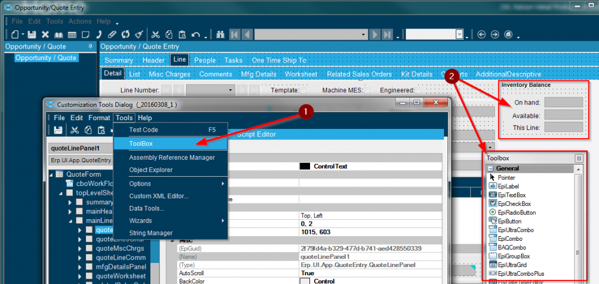

# Quote Line Availability for Epicor
In Sales Order Entry there is a window that displays the inventory balance of the part you’re working with. In Quote Entry there is no similar feature. The following steps go through the process of creating a similar window within Quote Entry.

## Initial Setup Steps ##

#### Navigate to this program from the Main Menu:

_Sales Management > Quote Management > General Operations > **Opportunity/Quote Entry**_ 

---

1. Make sure you have developer mode turned on and open Opportunity/Quote Entry. Under Tools open the Customization Menu. Then from the Customization Window under Tools open the Toolbox.
2. Use the toolbox and create the blank fields and labels under the Line>Details tab.

1. To begin, open the Customization Tools Dialog window. Under Tools select Data Tools.

1. Add a foreign key view linking the QuoteDtl to the PartNum.

1. Add a sub table key view linking the PartNum to the Part Warehouse.

1. From the Customization Tools Dialog under Wizards > Form Event Wizard select EpiViewNotification and QuoteDtl. Click the right arrow and click update event code.

Within the Script editor some new code has automatically been added. This code watches when changes are made to QuoteDtl. We will add some custom code that will automatically run when that event occurs.
